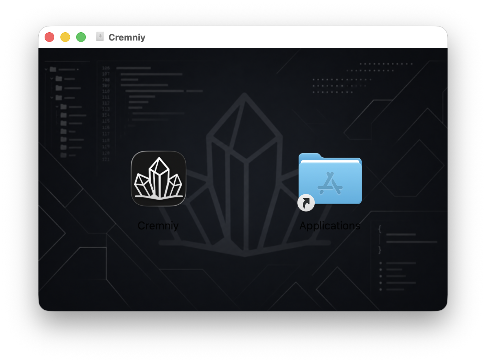

<div align="center">


<br>
<h3>Cremniy</h3>
<h6>All tools for low-level development are combined and linked in a single application — write code, edit bytes, and analyze binaries without extra windows</h6>

[](LICENSE)
[](CONTRIBUTING.md)
[](https://t.me/cremniy_com)
<br>
[](https://en.cppreference.com/w/cpp/17)
[](https://www.qt.io/)

English • [Русский](README_ru.md)

</div>

<br>

## What is Cremniy?

**Cremniy** is an integrated environment for low-level development. Instead of keeping a HEX editor in one window, a disassembler in another, and a code editor in a third — all tools are combined and linked in a single convenient application.

**Designed for:**

- 🛠 System software developers
- 🔍 Reverse engineers
- 🔐 Cybersecurity specialists
- 📡 Embedded systems developers

## Why Cremniy?

Low-level development today means using a code editor, HEX editor, disassembler, debugger, all opened **in separate windows**.

You constantly **switch** between different windows, and the tools are **not linked** together.

#### **Cremniy solves this!**
- 🔘 Everything is in one place
- 🔗 All tools are connected
- 💻 Unified workflow


## Features ✨

### Available now

| Feature | Description |
|---|---|
| 📝 Code editor | Write and edit low-level code with syntax support |
| 🔢 HEX editor | Inspect and modify binary data at the byte level (patching) |
| 🔧 Disassembler | Decode machine instructions into readable assembly |

### Coming soon

- 🐛 **Debugger** — step through execution, inspect registers and memory
- 🧠 **Memory visualization** — visual maps of memory layout and allocation

## Contributing 👋

Contributions are **welcome and encouraged**.

Whether it's a bug fix, a new feature, or an improvement to documentation — feel free to open an issue or submit a pull request.

All tasks can be found in [**GitHub Projects**](https://github.com/orgs/munirov/projects/2/views/1).

All contributors are credited in [ACKNOWLEDGEMENTS.md](ACKNOWLEDGEMENTS.md) and mentioned in videos on the [YouTube channel](https://www.youtube.com/@igmunv).

For guidelines, see [CONTRIBUTING.md](CONTRIBUTING.md).

> [!WARNING]
> If you would like to take on a task, please leave a comment on the corresponding [Issue](https://github.com/munirov/cremniy/issues). This helps prevent duplicate work.
>
> Additionally, once you submit a Pull Request, reference the corresponding [Issue](https://github.com/munirov/cremniy/issues) in the PR description using `Closes #ISSUE_NUMBER`.

## Build 🛠️

### Prerequisites

| Dependency | Minimum version |
|---|---|
| **[CMake](https://cmake.org/download/)** | 3.16 |
| **[Qt](https://www.qt.io/development/download-qt-installer-oss)** | 6.8.2 |
| **[libgit2](https://libgit2.org/)** | 1.x |
| **C++ compiler** | C++17 compliant |

<details>
<summary><b>🪟 Windows</b></summary>

1. Install [MSYS2](https://www.msys2.org/)
2. Install MinGW, CMake, Qt6-base, and libgit2 via **MSYS2 terminal**:
```base
pacman -S --needed base-devel mingw-w64-ucrt-x86_64-toolchain mingw-w64-ucrt-x86_64-cmake mingw-w64-ucrt-x86_64-qt6-base mingw-w64-ucrt-x86_64-libgit2
```
3. Add MSYS2 package directory to PATH  
   MSYS2 packages are located in `C:\msys64\ucrt64\bin` by default.

</details>

<details>
<summary><b>🐧 Linux (Debian-based / Fedora)</b></summary>

For Debian-based distributions:
```bash
sudo apt update
sudo apt install cmake g++ qt6-base-dev qt6-svg-dev qt6-tools-dev-tools libgit2-dev zlib1g-dev libssl-dev libpcre2-dev libhttp-parser-dev
```
For Fedora:
```bash
sudo dnf update --refresh
sudo dnf install cmake gcc-c++ qt6-qtbase-devel qt6-qtsvg-devel qt6-qttools-devel libgit2-devel zlib-devel openssl-devel pcre2-devel http-parser-devel
```

> ℹ️ **NOTE:** 
> If `qt6-base-dev` is unavailable in your distribution's repositories, use the [official Qt installer](https://www.qt.io/download-qt-installer-oss) instead.

</details>

<details>
<summary><b>🍎 macOS</b></summary>

Using [Homebrew](https://brew.sh/):

```bash
brew install cmake qt@6 libgit2
```

</details>

### Build in Linux

```bash
git clone https://github.com/igmunv/cremniy.git
cd cremniy

mkdir build && cd build
cmake ../src
cmake --build .
```

#### Release build

```bash
cmake ../src -DCMAKE_BUILD_TYPE=Release
cmake --build . --config Release
```

### Build in Windows

```bash
git clone https://github.com/igmunv/cremniy.git
cd cremniy

mkdir build && cd build
cmake -G "MinGW Makefiles" ..\src
cmake --build .

```

#### Release build

```bash
cmake ..\src -DCMAKE_BUILD_TYPE=Release
cmake --build . --config Release
```

## 🐧 Linux Installation Guide (Fedora-based distributions)

These instructions apply to systems using the **DNF / RPM** package manager.

### 🛠 Step-by-Step Installation:

1. **Download the RPM package** from the Assets section of the latest GitHub release.
2. Open the **Terminal**.
3. Navigate to the directory where the file was downloaded (e.g., the Downloads folder):
   ```bash
   cd ~/Downloads
   ```
4. Run the installation command:
   ```bash
   sudo dnf install ./cremniy-0.3.2-10.fc41.x86_64.rpm
   ```
   *Note: The `dnf` package manager will automatically install `cremniy` along with all required dependencies.*

5. Done! Once the process is complete, you can launch the application.


## 🍏 macOS Installation Guide (.dmg)

### 📦 Installation:

1. **Download the DMG file** from the Assets section of the latest GitHub release.
2. Double-click the downloaded `.dmg` file to mount it.
3. Drag the **Cremniy** icon and drop it directly onto the **Applications** folder shortcut.



4. Once the copying is complete, you can find and launch **Cremniy** from your Applications folder or Launchpad.

### 🛠 Troubleshooting: Post-Installation Guide (Quarantine Removal)

If you encounter the following error upon launching the application for the first time:
> *“App is damaged and can’t be opened”* or *“Apple cannot check it for malicious software”*

This occurs because the macOS built-in security system (Gatekeeper) puts downloaded files into quarantine. To fix this, you need to clear the Apple file attributes:

### 🛠 Step-by-Step Quarantine Removal Guide:

1. Open the built-in **Terminal** app.
   *(You can find it via Spotlight search by pressing `Cmd + Space` and typing "Terminal")*
2. Paste the following command **directly into the Terminal window**:
   ```bash
   sudo xattr -cr /Applications/Cremniy.app
   ```
3. Press **Enter**.
4. The Terminal will prompt you to enter your **Mac password** (administrator password).
   *⚠️ Note: Characters or asterisks **will not be displayed** as you type your password. This is a standard macOS security feature. Just type your password blindly and press **Enter**.*

Done! Restart the application. It should now open without any warnings.

## License 📖

Distributed under the terms described in [LICENSE](LICENSE).
